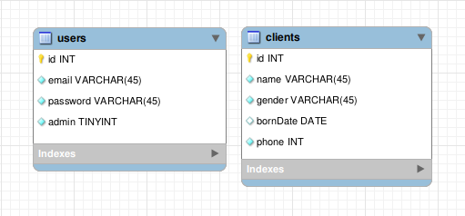

# JK Estética [Back-End]

Essa API foi criada para alimentar um banco de dados de cadastro de clientes de um clínica de estética. O projeto foi feito em Node.js, com javascript e o banco de dados escolhido foi o PostGresSQL, por conta do Supabase. Esse é o esqueleto do DB:




<!-- ## Documentação da API

#### Retorna todos os itens

```http
  GET /clientes
```

| Parâmetro   | Tipo       | Descrição                           |
| :---------- | :--------- | :---------------------------------- |
| `api_key` | `string` | **Obrigatório**. A chave da sua API |

#### Retorna um item

```http
  GET /api/items/${id}
```

| Parâmetro   | Tipo       | Descrição                                   |
| :---------- | :--------- | :------------------------------------------ |
| `id`      | `string` | **Obrigatório**. O ID do item que você quer |

#### add(num1, num2)

Recebe dois números e retorna a sua soma.
 -->
